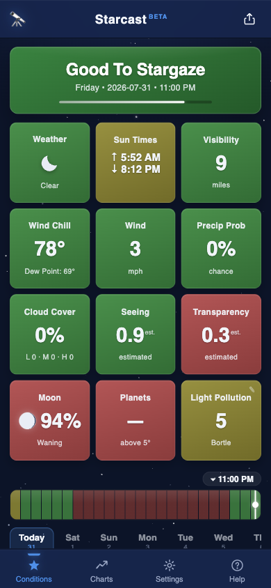
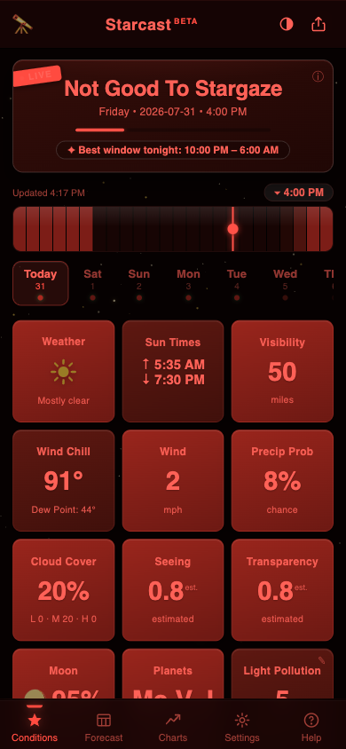

# 🔭 Starcast

**Is it good to stargaze at my location right now?**

Starcast is a single-page stargazing-conditions dashboard inspired by the iOS app
*Good To Stargaze* (not affiliated). It blends the hourly weather forecast, on-device
sun/moon/planet ephemeris math, and your local light-pollution level into a single
color-coded verdict — plus a 3×4 grid of condition tiles, a scrubbable 24-hour
timeline, day tabs for the full 14-day forecast, and 72-hour charts.



## Features

- **Verdict banner** — "Good To Stargaze" / "Marginal Stargazing" / "Not Good To
  Stargaze" for the exact hour you scrub to, with a LIVE ribbon on the current hour.
- **12 condition tiles**, each independently color-coded green/olive/red: weather,
  sun times, visibility, wind chill, wind, precipitation probability, cloud cover,
  seeing, transparency, moon phase (with a real phase graphic), visible planets,
  and your Bortle light-pollution class.
- **24-hour scrubbable timeline** colored hour-by-hour by overall score, with
  daylight hours dimmed, plus day tabs across the whole forecast range.
- **Forecast grid** — a Clear Outside-style hour-by-hour table for the next
  7 days: cloud layers, precipitation, wind, temperature/dew point, humidity,
  seeing, transparency, and moon-up per hour, every cell color-coded, with sun
  and moon rise/set times and the astronomical-darkness window per day.
- **Automatic light pollution** — your Bortle class is measured on the fly
  from David Lorenz's World Atlas 2024 zenith-brightness tiles for your exact
  coordinates, and updates whenever your location changes.
- **Interactive charts** — cloud (total + high), temperature + dew point,
  wind, and seeing/transparency over 24 h / 3 d / 7 d, with touch/hover value
  tooltips, daylight shading, and a "now" marker.
- **Built for the field** — installable PWA (Add to Home Screen) with an
  offline service worker that serves your last forecast when there's no
  signal; "best window tonight" readout in the banner; per-night quality dots
  on the day tabs; swipe the tile grid to change days; an "Updated h:mm"
  staleness readout that flags offline/old data.
- **Red night mode** — one tap in the header shifts the entire app to deep
  red on black to preserve dark adaptation at the eyepiece (brightness
  encodes condition quality while hue is unavailable).

  
- **Tonight's Sky card** — moon phase with upcoming new/full moon dates,
  Milky Way core peak altitude, per-planet rise times and peak altitudes for
  the night, active meteor showers (with moonlight warnings), an aurora Kp
  outlook for relevant latitudes, and a cross-model cloud-forecast confidence
  check (GFS vs ICON vs ECMWF).
- **Physics-based seeing** — when 7Timer is unreachable, the seeing estimate
  is driven by measured 250/500 hPa upper-air winds (jet-stream shear, the
  real driver of astronomical seeing) rather than surface conditions alone.
- **Sky map** — a real planetarium view for the scrubbed hour: 1,637 stars in
  their true colors (from B−V), all 88 constellation figures and names, the
  Milky Way, the Moon rendered at its actual phase, and the naked-eye planets.
  Tap anything to identify it. The sky brightens toward the horizon by your
  measured light pollution, stars dim through atmospheric extinction, and the
  Milky Way fades as your Bortle number rises.
- **AR mode** — on phones, the Sky tab can track your device's motion sensors
  (compass corrected to true north via an embedded WMM2025 model) with
  optional camera passthrough.
- **Calendar export** — the 📅 button on the best-window pill downloads an
  `.ics` event for that night's window.
- **Responsive layouts** — phone-first, a two-pane layout on tablets
  (scrubber + Tonight's Sky beside the tile grid), and a desktop layout with
  a 2×2 chart dashboard and two-column settings.
- **Explainable score** — tap the verdict banner for a metric-by-metric
  breakdown showing each factor's weight, score, and any hard caps applied.
- **Saved locations & shareable links** — keep up to 8 favorite spots
  (renamable), compare them with a "Your spots tonight" cloud outlook to pick
  where to drive, and share URLs that open your exact location
  (`?lat=…&lon=…&name=…`).
- **Accessibility** — optional color-blind-safe palette (blue/amber/
  vermillion), screen-reader announcements for the verdict, keyboard
  scrubbing on the timeline.
- **All astronomy computed client-side**: solar and lunar altitude, moon
  illumination and phase direction, and planet visibility from Keplerian orbital
  elements. No astronomy libraries, no API keys, no server.

## Data sources

- **[Open-Meteo](https://open-meteo.com)** — hourly weather forecast, sunrise/sunset,
  and city geocoding. Free for non-commercial use, no API key, CORS-enabled.
- **[7Timer!](https://www.7timer.info)** — astronomical seeing and transparency from
  the ASTRO product (~72 h coverage). When it's unreachable or out of range, Starcast
  falls back to a clearly-marked heuristic estimate.
- **[David Lorenz's Light Pollution Atlas 2024](https://djlorenz.github.io/astronomy/lp/)**
  — zenith sky brightness decoded client-side from his public binary tiles and
  converted to an approximate Bortle class.
- **[Open-Meteo Air Quality](https://open-meteo.com/en/docs/air-quality-api)** —
  aerosol optical depth (CAMS), used to sharpen the transparency estimate.
- **[NOAA SWPC](https://www.swpc.noaa.gov/)** — planetary K-index forecast for
  the aurora outlook.
- **[BigDataCloud](https://www.bigdatacloud.com/)** — free reverse geocoding,
  used only to put a real place name on your GPS position.
- **[HYG Database](https://www.astronexus.com/hyg)** — star catalog for the Sky map
  (CC BY-SA 4.0); baked into `data/sky.json` via `node tools/build-sky-data.mjs`.
- **[d3-celestial](https://github.com/ofrohn/d3-celestial)** — constellation line
  figures for the Sky map (BSD-3-Clause).
- `data/sky.json` is itself a derivative work of the HYG Database and is
  therefore also licensed CC BY-SA 4.0.
- **[World Magnetic Model 2025](https://www.ncei.noaa.gov/products/world-magnetic-model)**
  — declination coefficients (NOAA/NCEI & BGS, public domain); baked into
  `js/wmmcof.js` via `node tools/build-wmm.mjs`.

## Tests & CI

```bash
npm test   # node --test — no dependencies to install
```

Pins the ephemeris math (solar altitude, lunation solver self-consistency,
planet visibility), the full scoring table with its hard caps, the Bortle
decode thresholds, the Tonight's Sky helpers, and the pure app logic in
`js/logic.js` (share-link parsing, DST 23/25-hour day grouping, night-window
selection, ICS generation). GitHub Actions runs the suite on every push and
fails the build if app files change without a `sw.js` VERSION bump.

All displayed times use the forecast location's timezone (as reported by
Open-Meteo), never your browser's.

## Run locally

No build step, no dependencies:

```bash
python3 -m http.server
```

Then open <http://localhost:8000>. (Any static file server works — this is exactly
how GitHub Pages serves it.)

## Deploy to GitHub Pages

1. Create a new repository on GitHub (e.g. `starcast`).
2. Push this folder to it:

   ```bash
   git init
   git add .
   git commit -m "Starcast"
   git branch -M main
   git remote add origin https://github.com/YOUR_USERNAME/starcast.git
   git push -u origin main
   ```

3. On GitHub, open the repo → **Settings** → **Pages**.
4. Under **Build and deployment**, set **Source** to **Deploy from a branch**.
5. Choose branch **main** and folder **/ (root)**, then click **Save**.
6. Wait a minute, then visit `https://YOUR_USERNAME.github.io/starcast/`.

The repo includes a `.nojekyll` file so GitHub Pages serves every file as-is, and
all asset paths are relative, so the app works from a project subpath out of the box.

## Project structure

> Contributor note: `sw.js` precaches the app shell — bump its `VERSION`
> constant whenever you change app files so clients pick up the new deploy.

```
index.html       app shell + all five views
.nojekyll        tells GitHub Pages to skip Jekyll processing
manifest.webmanifest + sw.js + icon-*.png   PWA install & offline support
css/style.css    the whole design system
js/app.js        entry point: state, boot, routing, event wiring
js/weather.js    Open-Meteo + 7Timer fetch/parse
js/lightpollution.js  Lorenz atlas tile decoding → Bortle estimate
js/astro.js      sun / moon / planet ephemeris + rise/set solver (Meeus-style, ±1°)
js/score.js      per-metric scoring + weighted overall verdict
js/ui.js         all DOM rendering (tiles, timeline, charts, SVG icons)
```
